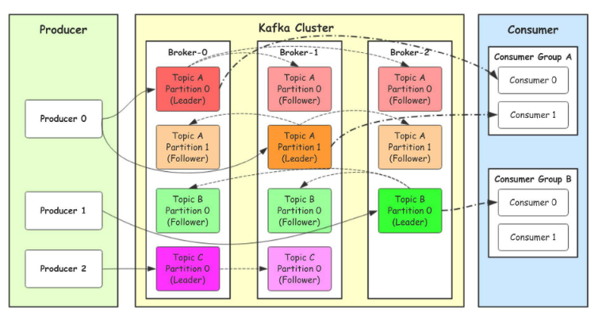

## kafka

### 基础概念
1. Topic(话题)：Kafka中用于区分不同类别信息的类别名称。由producer指定
2. Producer(生产者)：将消息发布到Kafka特定的Topic的对象(过程)
3. Consumers(消费者)：订阅并处理特定的Topic中的消息的对象(过程)
4. Broker(Kafka服务集群)：已发布的消息保存在一组服务器中，称之为Kafka集群。集群中的每一个服务器都是一个代理(Broker). 消费者可以订阅一个或多个话题，并从Broker拉数据，从而消费这些已发布的消息。
5. Partition(分区)：Topic物理上的分组，一个topic可以分为多个partition，每个partition是一个有序的队列。partition中的每条消息都会被分配一个有序的id（offset）
Message：消息，是通信的基本单位，每个producer可以向一个topic（主题）发布一些消息。
### 消息
消息由一个固定大小的报头和可变长度但不透明的字节阵列负载。报头包含格式版本和CRC32效验和以检测损坏或截断
### 架构

### ACK
* 0代表producer往集群发送数据不需要等到集群的返回，不确保消息发送成功。安全性最低但是效 率最高。
* 1代表producer往集群发送数据只要leader应答就可以发送下一条，只确保leader发送成功。
* allall代表producer往集群发送数据需要所有的follower都完成从leader的同步才会发送下一条，确保 leader发送成功和所有的副本都完成备份。安全性最⾼高，但是效率最低。

## 注意事项

1. 启动可能报错 `joptsimple.UnrecognizedOptionException: zookeeper is not a recognized option`
  原因是： `.\bin\windows\kafka-topics.bat --create --zookeeper localhost:2181 --replication-factor 1 --partitions 1 --topic test`
    这种方式已经过时了,改为：
`bin\windows\kafka-topics.bat --create --bootstrap-server localhost:2181 --replication-factor 1 --partitions 1 --topic test`

2. 123